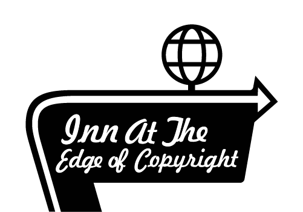

# Inn at the Edge of Copyright
**Version 2.0**

[](https://innattheedge.herokuapp.com/)

[](./LICENSE)
[](#version-updates)


## Table of Contents
 * [Overview](#overview)
 * [Getting Started](#getting-started)
   * [Game Commands](#game-commands)
 * [Contributing](#contributing)
 * [Credits](#credits)
 * [Questions](#questions)
 * [Issues & Updates](#issues-and-updates)
   * [Issues](#issues)
   * [Version Updates](#version-updates)
 * [License](#license)

## Overview

The Inn at the Edge of Copyright is a text-based program for anyone with a crave for an adventure. Our project is a MUD or Multi-User-Dungeon RPG loosely based on The Hitchhiker's Guide to the Galaxy series by Douglas Adams and inspired by text-based MUDs of the early days of the internet. The Inn At The Edge is where all who are lost can find a home.

[](https://innattheedge.herokuapp.com/)

## Getting Started

For the time being, we are useing Auth0 for user login. After you login, you will be instructed to give yourself a character name. Using the commands below, you should get the hang of the Inn in no time!

### Game Commands

```
get          --Pick up an item
look         --You look around you
drop         --You drop an item
inventory    --You check your inventory
move         --You move through an exit
speak        --You speak
remove       --You take off an item you are wearing
stats        --You call up your character stats
juggle       --You juggle something
emote        --You describe an action
sleep        --You go to sleep
wake         --You wake up
position     --You change position
help         --check command usage
examine      --Look closely at an item
```

[**Join us in the Inn here!**](https://innattheedge.herokuapp.com)

## Contributing

* [Nancy "Cosmo The Magnificent" Lambert-Brown](https://github.com/n-lambert)
* [Talia "Quill" Vazquez](https://github.com/taliavazquez)
* [Plover "Chordori" Brown](https://github.com/rebgrasshopper)
* [Nicholas "Shambles" Konzen](https://github.com/NTKonzen)
* [Kira "Bismuth the KILer" Lowrey](https://github.com/KILowrey)
* [Mando Estrada](https://github.com/Mando619)

### Past Contributers (NPCs)
* [Jeneth "6one9" Diesta](https://github.com/jen6one9)

## Credits

### Built and Running With:

* React and JavaScript
* Express and Node.js
* Bootstrap
* Socket.io
* MongoDB
* Heroku

### NPM Packages:

```
* axios                - Promise based HTTP client
* cors                 - Express middleware to enabel CORS
* dotenv               - .env to process.env module
* express              - Web server for Node.js
* if-env               - Simplify npm scripts
* mongoose             - MongoDB object modeling tool
* @auth0/auth0-react   - Auth0 SDK for React SPA's
```

## Questions

If you have any questions that this README doesn't cover, you can reach out to us at [innattheedgeofcopyright@gmail.com](mailto:innattheedgeofcopyright@gmail.com) or contact a [contributor](#contributing).

## Issues and Updates

### Issues

If you have found an issue with the game, you can open a GitHub Issue [here](https://github.com/n-lambert/Inn-At-The-Edge-of-Copyright/issues)

#### Known Issues:

 1. We're in the clear boys... for now -_-

We are working at fixing these bugs as soon as possible! Thank you for your patience.

### Version Updates

#### Version 2.0

* Refactored the app from the ground up to use React.js, MongoDB, and Socket.io.
* Added Social Sign-in with Auth0

#### [View Version 1 here](https://github.com/n-lambert/Inn-At-The-Edge-of-Copyright/tree/V1)

### Future Development

The Inn at the Edge of Copyright team is here for the long haul. We have lots of cool features in store! But, for the time being, we'd like to keep these under wraps.

## License

[GNU General Public License V3](LICENSE)